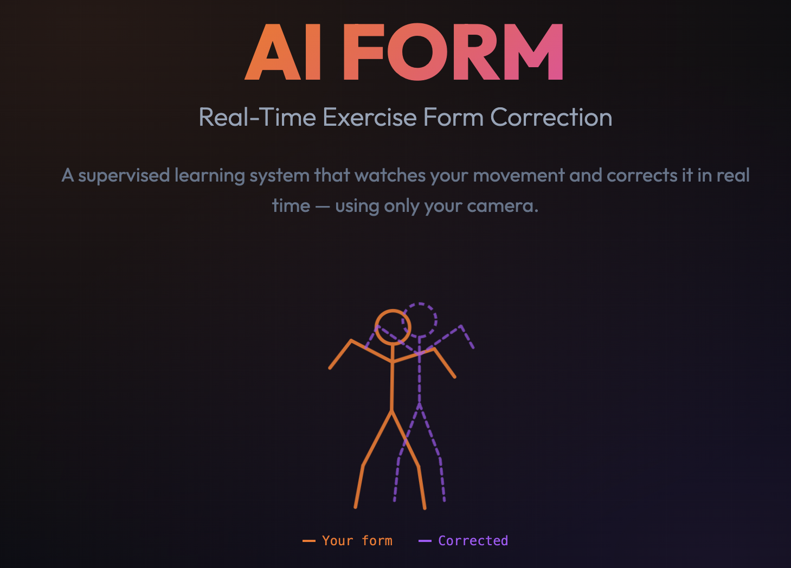

## Quick Start

Run with Docker (no setup needed):

```bash
docker run -p 8000:8000 kayasmus/ai-form-analyzer
```

Then open http://localhost:8000 in your browser.

**Docker Hub:** https://hub.docker.com/r/kayasmus/ai-form-analyzer

---

## 🌐 Live Demo

Check out the [**AI Form Analyzer project page**](https://kayasmus.github.io/ai_form/) for a full overview of the system, methodology, and results.

[](https://kayasmus.github.io/ai_form/)
